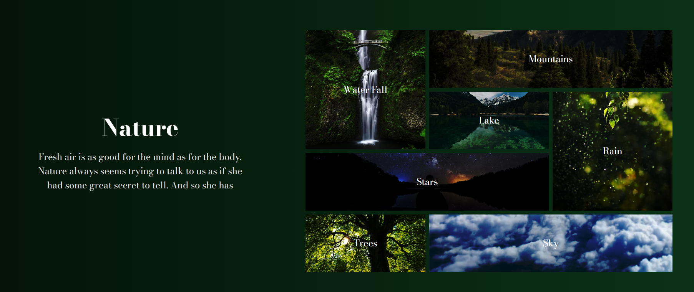

# 🌿 Nature Layout

A simple and responsive **Nature-themed web layout** built using **HTML & CSS**.  
This project focuses on clean design, layout structuring, and visual aesthetics inspired by nature.

---

## 🌟 About the Project
- Nature-inspired website layout
- Clean and minimal UI design
- Beginner-friendly front-end project
- Focuses on layout, colors, and responsiveness

---

## 🛠️ Technologies Used
- **HTML5**
- **CSS3**

---

## 📂 Project Structure

```text
Nature-Layout/
│── index.html        # Main HTML file
│── style.css         # Styling file
│── assets/           # Images / media (if any)
│── README.md         # Project documentation
```

---

## 🎯 Features

- Nature-based color palette
- Well-structured layout
- Responsive design (basic)
- Easy-to-read and maintain code

---

## 🚀 Getting Started

1. Clone the repository: `git clone https://github.com/Badal-06/Nature-Layout.git`
2. Navigate to the project folder: `cd Nature-Layout`
3. Open `index.html` in your web browser to view the layout.
4. Modify `style.css` to customize the design as per your preference.

---

## 📸 Preview



---

## 🌐 Live Demo

Check out the live version of this project here:  
🔗 **Live Demo:** [Live Demo](https://badal-06.github.io/Nature-Layout/)

> Hosted using **GitHub Pages**

---

## 📖 Learning Objectives

- Practice HTML page structuring
- Improve CSS layout and styling skills
- Understand design consistency
- Build confidence in front-end basics

---

## 🔮 Future Improvements

- Add animations and transitions
- Improve responsiveness
- Add JavaScript interactivity
- Convert into a multi-page website

---

## 📬 Connect

- GitHub: [Badal-06](https://github.com/Badal-06) 
- Repo Link: [Nature Layout](https://github.com/Badal-06/Nature-Layout)

---

<div align="center">

### ⭐ If you find this repository helpful, please consider giving it a star! ⭐

**Happy Coding!** 🚀

</div>